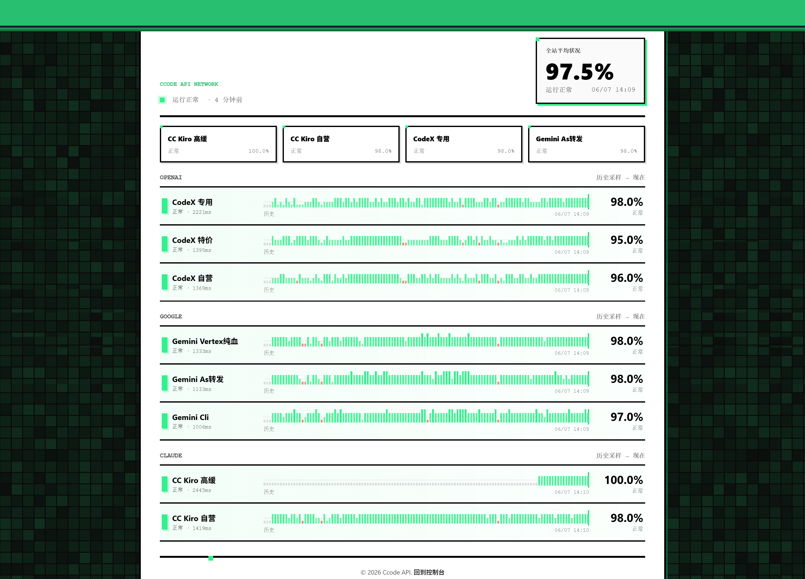
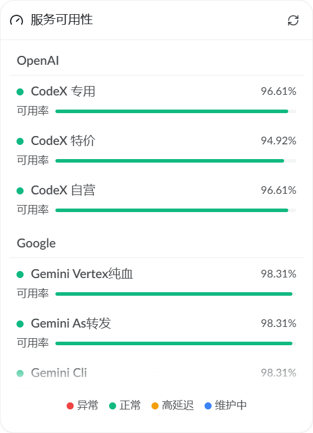

# status

[English](./readme.md) | 中文

轻量级 AI 模型状态监控面板，单文件部署，零外部依赖（除 SQLite）。支持多分组、多模型、Uptime Kuma 兼容推送。支持 NewAPI 识别。

## 演示

**Web 面板**



**NewAPI 兼容**



## 快速开始

```bash
# 复制配置模板
cp config.template.json config.json
# 编辑 config.json 填入你的模型和密钥
# 直接运行
go run .
# 访问 http://localhost:8080
```

## 编译

```powershell
# Windows
$env:CGO_ENABLED="0"
go build -ldflags "-s -w" -o status-windows-amd64.exe .

# Linux 交叉编译
$env:CGO_ENABLED="0"
$env:GOOS="linux"
$env:GOARCH="amd64"
go build -ldflags "-s -w" -o status-linux-amd64 .
```

编译产物为单个可执行文件 + `status.html`，部署时放在同目录即可。

## 配置说明

配置文件为 `config.json`，模板见 `config.template.json`。

### 完整结构

```jsonc
{
  "port": 8080,                      // 监听端口，默认 8080，重启生效
  "interval": 60,                    // 检测间隔（秒），默认 60
  "frontend": {                      // 前端展示配置
    "title": "My API Status",        // 页面标题（同时用于 <title> 和 <h1>）
    "icon": "https://example.com/icon.png",  // favicon 和 logo，留空则不显示
    "subtitle": "实时监控各模型可用性",        // 标题下方副标题
    "footer": "&copy; 2026 <a href=\"/\">Home</a>"  // 页脚，支持 HTML
  },
  "kuma": {                          // Uptime Kuma 推送配置（可选）
    "baseURL": "https://status.example.com",
    "slug": "my-status-page"
  },
  "groups": [ /* 见下方 */ ]
}
```

### groups 结构

```jsonc
{
  "name": "OpenAI",              // 一级分组名
  "subGroups": [
    {
      "name": "GPT-4o",          // 二级分组名（页面上显示的模型名）
      "kumaSlug": "gpt-4o",      // Uptime Kuma 独立推送 slug（可选）
      "models": [
        {
          "id": "gpt-4o",        // 模型 ID，用于 API 调用
          "provider": "openai-compat",  // 协议类型
          "baseURL": "https://api.openai.com/v1",
          "key": "sk-xxx",       // API Key
          "timeout": 30          // 超时秒数，默认 30
        }
      ]
    }
  ]
}
```

### 支持的 Provider（协议）

| provider | 说明 | 调用端点 |
|---|---|---|
| `openai-compat` | OpenAI 兼容协议（默认） | `POST {baseURL}/chat/completions` |
| `openai-response` | OpenAI Responses API | `POST {baseURL}/responses` |
| `google` | Google Gemini API | `POST {baseURL}/models/{id}:generateContent` |
| `anthropic` | Anthropic Claude API | `POST {baseURL}/messages` |

### 配置示例

**OpenAI 兼容（大多数中转站）：**

```json
{
  "id": "gpt-4o-mini",
  "provider": "openai-compat",
  "baseURL": "https://api.example.com/v1",
  "key": "sk-your-key",
  "timeout": 30
}
```

**Anthropic Claude：**

```json
{
  "id": "claude-sonnet-4-20250514",
  "provider": "anthropic",
  "baseURL": "https://api.anthropic.com",
  "key": "sk-ant-your-key",
  "timeout": 30
}
```

**Google Gemini：**

```json
{
  "id": "gemini-2.5-flash",
  "provider": "google",
  "baseURL": "https://generativelanguage.googleapis.com/v1beta",
  "key": "your-api-key",
  "timeout": 30
}
```

**OpenAI Responses API（Codex）：**

```json
{
  "id": "gpt-5.4-mini",
  "provider": "openai-response",
  "baseURL": "https://api.openai.com/v1",
  "key": "sk-your-key",
  "timeout": 30
}
```

## API 协议

| 端点 | 说明 |
|---|---|
| `GET /` | 状态面板页面 |
| `GET /api/status` | 状态数据（前端轮询） |
| `GET /api/config` | 配置信息（interval + frontend） |
| `GET /api/status-page/{slug}` | Uptime Kuma 兼容状态页 |
| `GET /api/status-page/heartbeat/{slug}` | Uptime Kuma 兼容心跳数据 |

### `/api/status` 响应结构

```jsonc
{
  "title": "My API Status",
  "overall": { "status": "up", "label": "运行正常" },
  "last_completed_at": "2026-06-07T12:00:00Z",
  "checking": false,
  "sections": [
    {
      "name": "OpenAI",
      "rows": [
        {
          "name": "gpt-4o",
          "sub_name": "GPT-4o",
          "status": "up",
          "label": "正常",
          "health_score": 99.5,
          "latency_ms": 230,
          "last_checked_at": "2026-06-07T12:00:00Z",
          "history": [{ "s": "up", "v": 1.0 }]
        }
      ]
    }
  ]
}
```

`status` 字段取值：`up` / `down` / `degraded` / `unknown`

### `/api/config` 响应结构

```jsonc
{
  "interval": 60,
  "frontend": {
    "title": "My API Status",
    "icon": "https://example.com/icon.png",
    "subtitle": "...",
    "footer": "..."
  }
}
```

## Uptime Kuma 集成

支持两种推送模式：

1. **全局推送**：配置 `kuma.baseURL` 和 `kuma.slug`，所有模型的平均状态推送到一个 slug
2. **子组独立推送**：在 `subGroups` 中设置 `kumaSlug`，每个子组独立推送

同时兼容 NewAPI 等使用 Uptime Kuma 公开状态页协议的工具，提供 `/api/status-page/` 和 `/api/status-page/heartbeat/` 端点。

## 前端定制

`frontend` 配置节控制页面所有品牌元素，无需修改 HTML：

- `title`：浏览器标签标题 + 页面主标题
- `icon`：favicon + 页面 logo（留空则隐藏 logo 区域）
- `subtitle`：标题下方说明文字
- `footer`：页脚内容，支持内联 HTML

## 技术栈

- Go（单文件，`modernc.org/sqlite` 纯 CGO-free SQLite 驱动）
- 纯 HTML/CSS/JS，无前端框架依赖
- 数据存储：本地 SQLite（`status.db`）

## License

[MIT](./LICENSE)

## Star History

<a href="https://www.star-history.com/?repos=tianjiangqiji%2Fstatus&type=date&legend=top-left">
 <picture>
   <source media="(prefers-color-scheme: dark)" srcset="https://api.star-history.com/chart?repos=tianjiangqiji/status&type=date&theme=dark&legend=top-left" />
   <source media="(prefers-color-scheme: light)" srcset="https://api.star-history.com/chart?repos=tianjiangqiji/status&type=date&legend=top-left" />
   
 </picture>
</a>